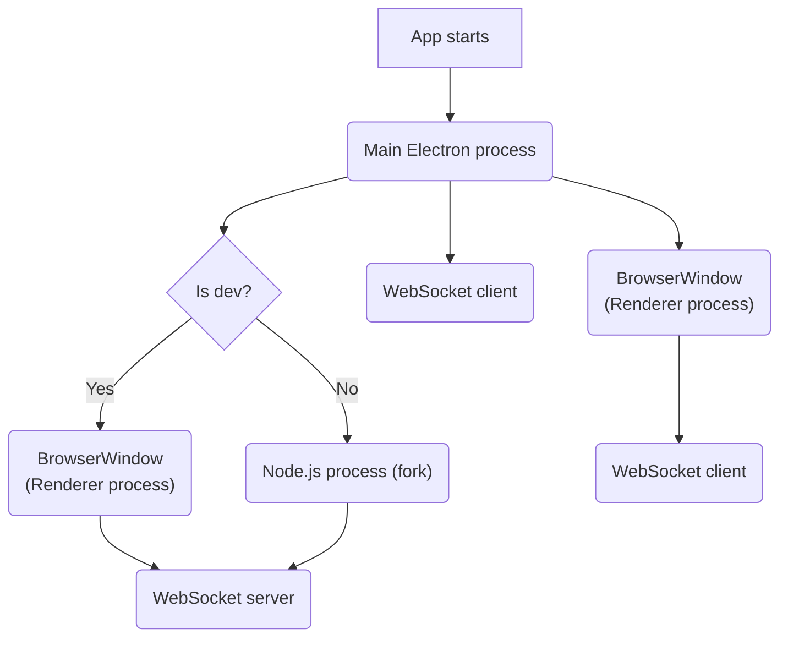
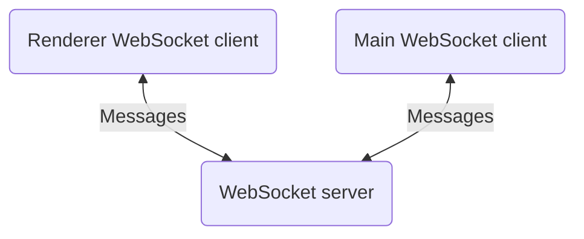

The application is built with [Electron](https://www.electronjs.org/).  
Before continuing, reading the [process model documentation](https://www.electronjs.org/docs/latest/tutorial/process-model) is highly recommended to understand the different Electron processes.

Because it's easy to make an Electron application unresponsive by blocking either the
[main process](https://www.electronjs.org/docs/latest/tutorial/performance#3-blocking-the-main-process)
or the [renderer process](https://www.electronjs.org/docs/latest/tutorial/performance#4-blocking-the-renderer-process),
the application forks a `Node.js` process, which hosts a `WebSocket` server.
This process does _almost all_ the heavy work, such as database/filesystem access, demo analysis, etc.  
It communicates with the main and renderer process through their `WebSocket` clients.

The following diagram shows the creation of essential components of the application when it starts:



As you can see, the `WebSocket` server is created from a [BrowserWindow](https://www.electronjs.org/docs/latest/api/browser-window) instead of a `Node.js` process during **development only**.  
It gives us a dedicated window to debug the WebSocket server using the Chrome DevTools.

## JavaScript bundles

The code of the application is split into several JavaScript bundles:

- The `WebSocket` server bundle
- The Electron main process bundle
- The Electron renderer process (UI) bundle
- The preload script bundle
- The CLI bundle

The renderer process doesn't have access to any `Node.js` API or [Electron main modules](https://www.electronjs.org/docs/latest/api/app).  
To expose the minimum amount of APIs to the renderer process, a [preload script](https://www.electronjs.org/docs/latest/tutorial/process-model#preload-scripts) is loaded when the `BrowserWindow` is created.

The following table shows which APIs are available in each bundle:

| Bundle           | APIs                               |
| ---------------- | ---------------------------------- |
| WebSocket server | Node.js                            |
| Main process     | Node.js, Electron main modules     |
| Preload          | Node.js, Electron renderer modules |
| Renderer process | WEB APIs, Preload script APIs      |
| CLI              | Node.js                            |

## Communication

### Main/Renderer process to WebSocket server

The main and renderer process use their `WebSocket` client to communicate with the `WebSocket` server.



Messages are JSON objects with the following shape:

```ts
type Message = {
  name: string;
  payload: unknown;
};
```

### Main process to renderer process

Sending messages from the main process to the renderer process is done using the `WebContents` instance of the `BrowserWindow` as described [here](https://www.electronjs.org/docs/latest/tutorial/ipc#pattern-3-main-to-renderer).  
It's helpful to update the UI from the main process.

Example:

```ts title='preload.js'
import { ipcRenderer, contextBridge } from 'electron';

contextBridge.exposeInMainWorld('csdm', {
  onShowSettings: (callback: () => void) => {
    ipcRenderer.addListener('show-settings', callback);

    return () => {
      ipcRenderer.removeListener('show-settings', callback);
    };
  },
});
```

```ts title='renderer.js'
const unListen = window.csdm.onShowSettings(() => {
  console.log('Show settings message received!');
});
unListen();
```

```ts title='main.js'
// mainWindow is the BrowserWindow instance
mainWindow.webContents.send('show-settings');
```

### Renderer process to main process

Sending messages from the renderer process to the main process is done using `ipcRenderer.invoke`/`ipcMain.handle` functions described [here](https://www.electronjs.org/docs/latest/tutorial/ipc#pattern-2-renderer-to-main-two-way).  
It's helpful to call Electron main modules (`app`, `dialog`, etc.) from the renderer process.

Example:

```ts title='preload.js'
import { ipcRenderer, contextBridge } from 'electron';

contextBridge.exposeInMainWorld('csdm', {
  isAppHidden: () => {
    ipcRenderer.invoke('is-app-hidden');
  },
});
```

```ts title='main.js'
import { ipcMain, app } from 'electron';

ipcMain.handle('is-app-hidden', () => {
  return app.isHidden();
});
```

```ts title='renderer.js'
<button
  onClick={() => {
    const isHidden = window.csdm.isAppHidden();
    console.log(isHidden);
  }}
>
  Check app hidden
</button>
```
